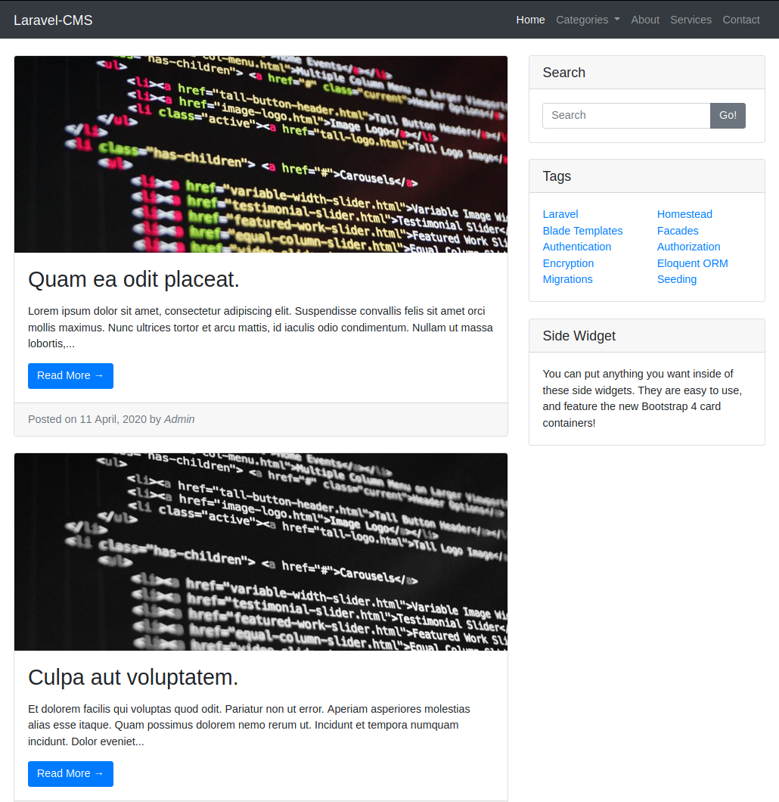
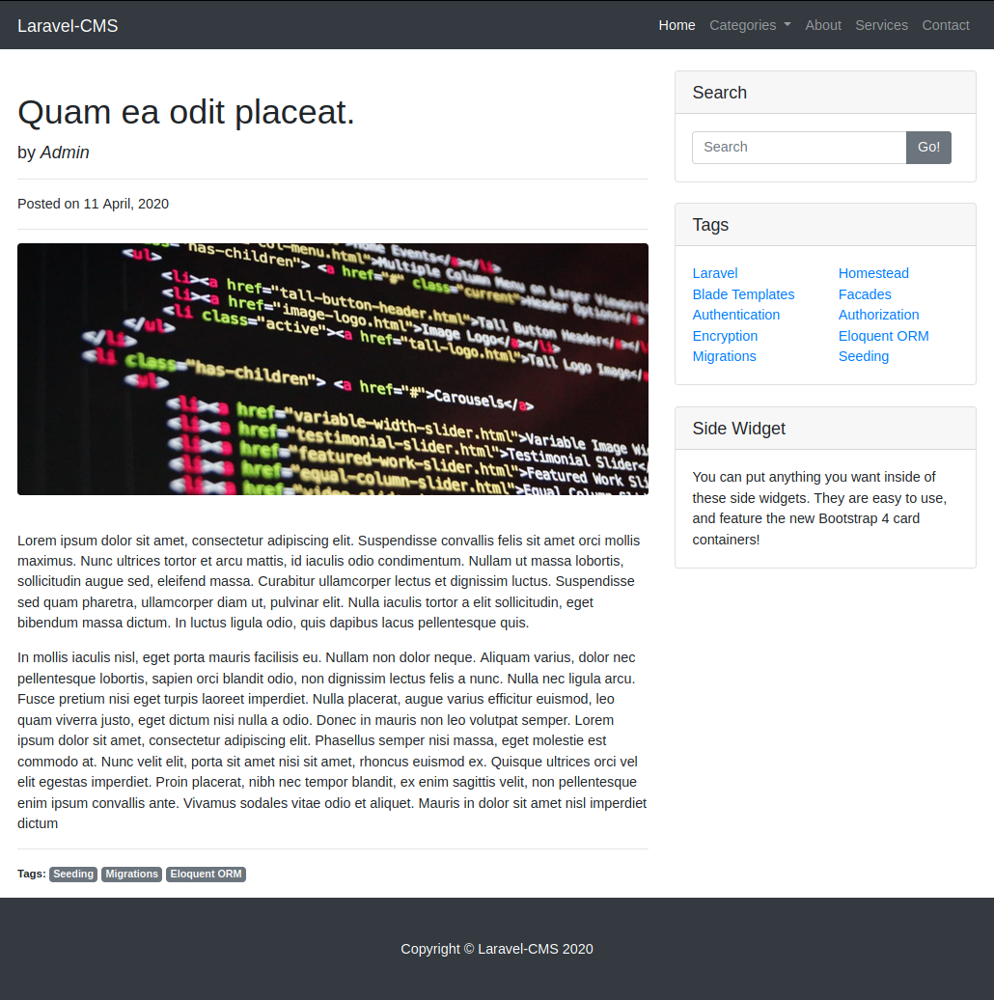

# Laravel-CRM
Open Source Blog/CMS

* Bootstrap 4
* Articles
* Categories
* Tags
* Search
* [Voyager Admin](https://github.com/the-control-group/voyager)

## Installation

### 1. Get the Code
Clone this repository:
```
git clone https://github.com/melihkocaturk/laravel-crm.git
```

### 2. Create a new database
Create a new database and add your database credentials to your .env file:
```
DB_HOST=localhost
DB_DATABASE=laravel-crm
DB_USERNAME=laravel-crm
DB_PASSWORD=password
```

### 3. Build database schema
```
php artisan migrate --seed
```
### 4. Install Voyager

Documentation available from https://voyager-docs.devdojo.com/getting-started/installation.

## Preview




